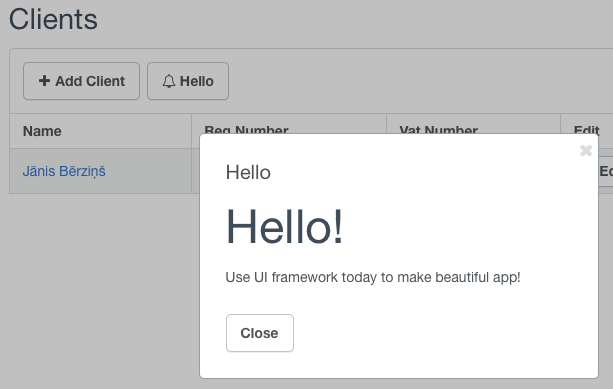

# Agile UI

**PHP Framework for building consistent Web User Interfaces.**

Many developers today have acknowledged that use of CSS framework is pretty essential to rapid development. Agile UI takes it to the next level and integrates CSS framework elements with a server-side classes. Now you don't even need to touch your CSS or HTML anymore, all you need is:

``` php
$cr = new CRUD('templates/crud.html');
$cr->setModel(new Client($db));

$cr->render();

// Anywhere in your code:
$html = $m->getHTML();
$js = $m->getJS();
```

 The above code will result in an interractive table like this:

Without extra effort on your side, this table will:

- Have pagination if required
- Contain Edit/Delete buttons
- Edit will bring up a pop-up with editing form

The code will keep running and handle call-backs by passing extra GET arguments to the base URL, which enables usage of AJAX and reloading inside View elements.

## Based on Agile Toolkit Concepts

Tens of thousands of developers have already used Agile Toolkit 4.3 or earlier, which today is one of the [most popular PHP UI Frameworks](https://www.google.co.uk/search?q=php+ui+framework&ie=UTF-8&oe=UTF-8&gfe_rd=cr&ei=Na7iV8mbN8GBaK7Ju7AD). Unfortunatelly the current verison of Agile Toolkit does not play well with other frameworks or applications. 

Agile UI is a refactor of the core functionality of Agile Toolkit:

- Can be used in any framework
- Has minimum dependencies
- Makes extensive use of Semantic UI and jQuery
- Works out of the box

Once Aglie UI is finished it will be re-integrated into next verison of Agile Toolkit.

## Renter Tree Concept

Agile Toolkit pioneered Render View Tree concept in 2011 and it's a fundamental principle of Agile UI framework today.  

``` php
$b = new Button(['Hello', 'icon' => 'bell']);
$b->on('click', $b->dialog('Hello', function($page){
     $page->add(new View('hello.html'));
     $page->add(new Button('Close'))
           ->js()->univ()->closeDialog();
}));

$cr->add($b, ['spot' => 'toolbar']);
```

 

There are over 20 base widgets based around Semantic UI and hundreds of more widgets are available through add-ons.

## Agile Data Integration

[Agile Data](https://git.io/ad) is a Database Abstraction Framework. It is a more flexible and modern way to define your business logic and interact with SQL or NoSQL database. Agile UI is built on top of Agile Data, which means that views and wigets such as CRUD, Forms, etc will be able to interact with your database in a very controlled way.

- You have extreme control over which tables/collections are accessible to Views
- You decide what conditions apply and what hooks to execute
- You can map columns, work with custom types
- Implement advanced patterns: audit, ggregates, RestAPI proxying and many more
- Make use of Secure Enclave - mechanism that Applies advanced ACL on data access

## Installation

Agile UI can be used in any framework to enhance their UI capabilities:

```
composer require atk4/ui
```

You will also need [Semantic UI](http://semantic-ui.com/introduction/getting-started.html), so make sure it's installed and properly loaded.

## Current Status

Agile UI is currently in the **planning stage**. This project is mainly a REFACTOR from http://github.com/atk4/atk4, so we will progress quickly.

[](https://gitter.im/atk4/atk4?utm_source=badge&utm_medium=badge&utm_campaign=pr-badge&utm_content=badge) [](https://packagist.org/packages/atk4/ui)


## Roadmap and Participating

You are welcome to take part in our refactor project and help us re-shape the future  
